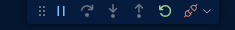
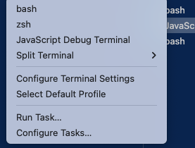
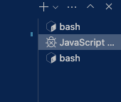
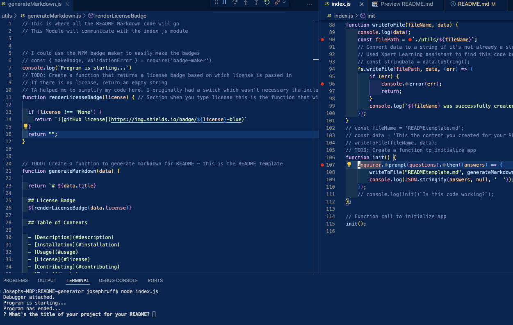

# README-generator

## Description

This CLI app generates a README file for you by prompting the user to request what they would like to include in their README file. The design is a professional README template and when you answer all the prompts it creates a new README file in the utlilities folder. 

## Finished Product 

This is the debugger control panel

This where you would select the debugger terminal in vs code so that you could start the app

This is where you would select the debugger CLI at the bottom right of your vs code

If you followed all of the starts correctly this is how it should look when the app starts

## Usage

 

## License

## Video Link

<https://drive.google.com/file/d/1MAO8WeRaZEF33g-9OGFgCLPYfATlJF2c/view?usp=sharing>

## GitHub Repo

<https://github.com/joegruff16/README-generator>

## Credits

- Used this website to help with generating my license badges
    - **<https://shields.io/badges>**